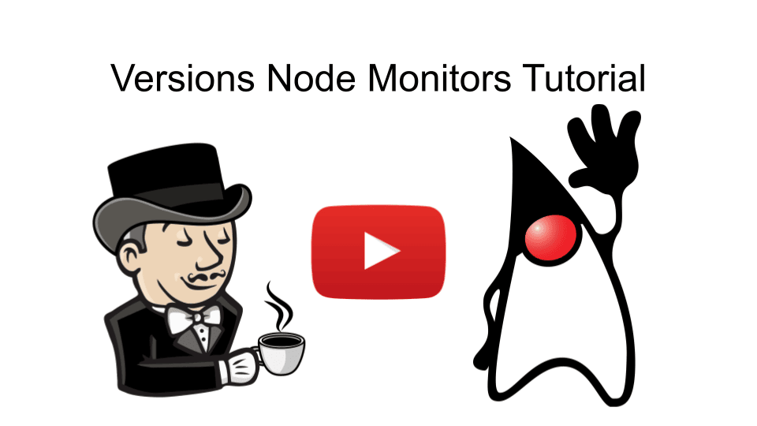
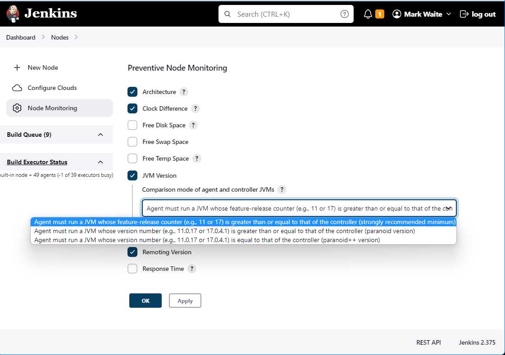

= Versions Node Monitors Plugin

This plugin offers two _node monitors_:

* Remoting Version
* JVM Version

== Plugin tutorial

== Remoting Version Node Monitor

NOTE: The link:https://github.com/jenkinsci/remoting/blob/master/README.md[remoting module] handles the network connection between the Jenkins controller and agents.

This monitor will disconnect an agent if it is not running the same version of remoting library as the version on the Jenkins controller.

== JVM Version Node Monitor

This monitor offers 3 levels of monitoring:

[cols="2", options="header,border"]
|===
| Level
| Description & Examples

| `Default`
a| Agent must run a JVM whose https://docs.oracle.com/en/java/javase/11/docs/api/java.base/java/lang/Runtime.Version.html[feature-release counter] (e.g., 11 or 17) is *greater than or equal to* that of the controller (strongly recommended minimum).

Even without this plugin, it is **critical** to the health of your Jenkins cluster that the feature-release counter of the agent JVM **match** that of the controller.

**Examples**:

* Java 11.0.21  agent will not be disconnected from a Java 11.0.22  controller
* Java 11.0.22  agent will not be disconnected from a Java 11.0.21  controller
* Java 11.0.22  agent will not be disconnected from a Java 11.0.22  controller
* Java 17.0.4   agent will not be disconnected from a Java 11.0.22  controller
* Java 11.0.22  agent **will be disconnected** from a Java 17.0.4   controller
* Java 17.0.4   agent will not be disconnected from a Java 17.0.4   controller
* Java 17.0.4   agent will not be disconnected from a Java 17.0.4.1 controller
* Java 17.0.4.1 agent will not be disconnected from a Java 17.0.4   controller
* Java 17.0.4.1 agent will not be disconnected from a Java 17.0.4.1 controller
* Java 17.0.5+8 agent will not be disconnected from a Java 17.0.5+7 controller
* Java 17.0.5+7 agent will not be disconnected from a Java 17.0.5+8 controller
* Java 17.0.4   agent **will be disconnected** from a Java 21.0.2   controller
* Java 21.0.2   agent will not be disconnected from a Java 17.0.4   controller
* Java 21.0.1   agent will not be disconnected from a Java 21.0.2   controller
* Java 21.0.2   agent will not be disconnected from a Java 21.0.1   controller
* Java 21.0.2   agent will not be disconnected from a Java 21.0.2   controller

| `Paranoid`
a| Agent must run a JVM whose https://docs.oracle.com/en/java/javase/11/docs/api/java.base/java/lang/Runtime.Version.html[version number] -- including feature-release counter, interim-release counter, update-release counter, and patch-release counter (e.g., 11.0.22 or 17.0.4.1) but _not_ including pre-release and build information (for example, 11.0.22+7, 17.0.10+7, or 21.0.2+13) -- is *greater than or equal to* that of the controller.

**Examples**:

* Java 11.0.21  agent **will be disconnected** from a Java 11.0.22  controller
* Java 11.0.22  agent will not be disconnected from a Java 11.0.21  controller
* Java 11.0.22  agent will not be disconnected from a Java 11.0.22  controller
* Java 17.0.4   agent will not be disconnected from a Java 11.0.22  controller
* Java 11.0.22  agent **will be disconnected** from a Java 17.0.4   controller
* Java 17.0.4   agent will not be disconnected from a Java 17.0.4   controller
* Java 17.0.4   agent **will be disconnected** from a Java 17.0.4.1 controller
* Java 17.0.4.1 agent will not be disconnected from a Java 17.0.4   controller
* Java 17.0.4.1 agent will not be disconnected from a Java 17.0.4.1 controller
* Java 17.0.5+8 agent will not be disconnected from a Java 17.0.5+7 controller
* Java 17.0.5+7 agent will not be disconnected from a Java 17.0.5+8 controller
* Java 17.0.4   agent **will be disconnected** from a Java 21.0.2   controller
* Java 21.0.2   agent will not be disconnected from a Java 17.0.4   controller
* Java 21.0.1   agent **will be disconnected** from a Java 21.0.2   controller
* Java 21.0.2   agent will not be disconnected from a Java 21.0.1   controller
* Java 21.0.2   agent will not be disconnected from a Java 21.0.2   controller

| `Paranoid++`
a| Agent must run a JVM whose https://docs.oracle.com/en/java/javase/11/docs/api/java.base/java/lang/Runtime.Version.html[version number] -- including feature-release counter, interim-release counter, update-release counter, and patch-release counter (e.g., 11.0.22 or 17.0.4.1) but _not_ including pre-release and build information (for example, 11.0.22+7, 17.0.10+7, or 21.0.2+13) -- is *equal to* that of the controller.

**Examples**:

* Java 11.0.21  agent **will be disconnected** from a Java 11.0.22  controller
* Java 11.0.22  agent **will be disconnected** from a Java 11.0.21  controller
* Java 11.0.22  agent will not be disconnected from a Java 11.0.22  controller
* Java 17.0.4   agent **will be disconnected** from a Java 11.0.22  controller
* Java 11.0.22  agent **will be disconnected** from a Java 17.0.4   controller
* Java 17.0.4   agent will not be disconnected from a Java 17.0.4   controller
* Java 17.0.4   agent **will be disconnected** from a Java 17.0.4.1 controller
* Java 17.0.4.1 agent **will be disconnected** from a Java 17.0.4   controller
* Java 17.0.4.1 agent will not be disconnected from a Java 17.0.4.1 controller
* Java 17.0.5+8 agent will not be disconnected from a Java 17.0.5+7 controller
* Java 17.0.5+7 agent will not be disconnected from a Java 17.0.5+8 controller
* Java 17.0.4   agent **will be disconnected** from a Java 21.0.2   controller
* Java 21.0.2   agent **will be disconnected** from a Java 17.0.4   controller
* Java 21.0.1   agent **will be disconnected** from a Java 21.0.2   controller
* Java 21.0.2   agent **will be disconnected** from a Java 21.0.1   controller
* Java 21.0.2   agent will not be disconnected from a Java 21.0.2   controller

|===

== Configuration Page

== Configuration as code

The node monitors can be configured automatically with the following link:https://plugins.jenkins.io/configuration-as-code/[configuration as code] example:

[source,yaml]
----
jenkins:
  nodeMonitors:
  - jvmVersion:
      comparisonMode: RUNTIME_GREATER_OR_EQUAL_MASTER_BYTECODE
      ignored: true
  - remotingVersion:
      ignored: true
----
